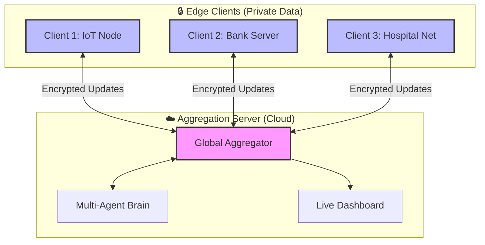
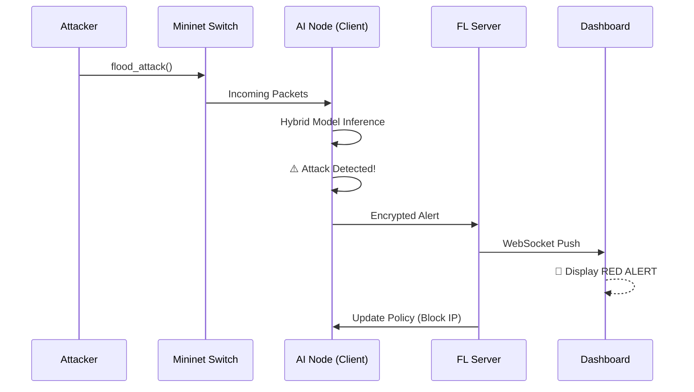
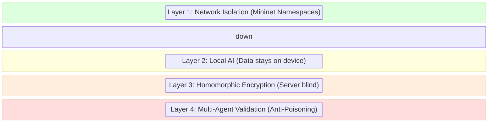

# 🖼️ FL-DDoS System Architecture (Visuals)

**Purpose:** Pictorial representation of the 12-Phase System for your presentation slides.

---

## 1. High-Level Hub & Spoke Design

This diagram shows how the **Central Server** orchestrates multiple **Edge Clients** while keeping data private.

---

## 2. The Hybrid Conv-Transformer (Internal Logic)

This is what happens inside the **AI Model** when a packet arrives.

```mermaid
graph LR
    Input[Packet Flow Input] --> Conv[1D CNN Layer]
    Conv -->|Micro-Patterns| Pos[Positional Encoding]
    Pos -->|Time Sequence| Trans[Transformer Encoder]
    Trans -->|Global Context| Attn[Attention Pooling]
    Attn -->|Critical Signal| Class[Classifier Head]
    Class --> Output[Attack / Benign]

    style Input fill:#eee,stroke:#333
    style Conv fill:#ff9,stroke:#333
    style Trans fill:#9f9,stroke:#333
    style Output fill:#f99,stroke:#333
```

---

## 3. Real-Time Attack Response Flow

From **Attacker** to **Defense** in milliseconds.

---

## 4. Zero Trust Security Layers

How we protect the system at every level.

---

## 📸 For Your Slides:

- **Slide 1 (Overview):** Use Diagram #1 to show the distributed nature.
- **Slide 2 (Innovation):** Use Diagram #2 to explain why your model is better than basic LSTM.
- **Slide 3 (Demo):** Use Diagram #3 to walk through your live demo steps.
